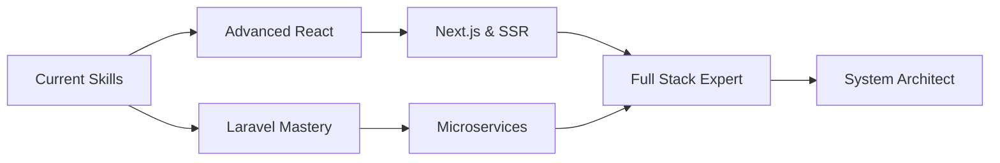

<div align="center">

<!-- Premium Animated Header -->


<br/>

<!-- Multi-Line Typing Animation -->
<p align="center">
  <a href="https://git.io/typing-svg">
    
  </a>
</p>

<!-- Premium Badge Collection -->
<p align="center">
  
  
  
  <br/>
  
  
  
</p>

<!-- Fancy Divider -->


</div>

<br/>

<!-- About Me Section with Animated GIF -->


##  Hey There, I'm Murad!

###  Full Stack Developer | Creative Thinker | Code Enthusiast

```typescript
const MuradHasan = {
    pronouns: "He" | "Him",
    location: "🇧🇩 Dhaka, Bangladesh",
    currentRole: "Full Stack Web Developer",
    company: "Freelance & Open Source",
    
    languages: {
        expert: ["JavaScript", "PHP", "HTML5", "CSS3", "SQL"],
        intermediate: ["TypeScript", "Python"],
        learning: ["Go", "Rust"]
    },
    
    technologies: {
        frontend: {
            frameworks: ["React.js", "Next.js"],
            libraries: ["jQuery", "GSAP", "Three.js"],
            styling: ["Tailwind CSS", "Bootstrap", "Sass", "Styled Components"],
            tools: ["Webpack", "Vite", "NPM"]
        },
        backend: {
            frameworks: ["Laravel", "Express.js"],
            languages: ["PHP", "Node.js"],
            databases: ["MySQL", "PostgreSQL", "SQLite", "MongoDB"],
            servers: ["Apache", "Nginx"]
        },
        mobile: {
            android: ["Java", "Kotlin", "Android Studio"],
            crossPlatform: ["React Native (Learning)"]
        },
        devOps: {
            tools: ["Docker", "Git", "GitHub Actions"],
            platforms: ["Linux", "Ubuntu", "Windows"]
        },
        design: {
            tools: ["Figma", "Adobe XD", "Canva"],
            focus: "UI/UX, Responsive Design, Accessibility"
        }
    },
    
    currentFocus: {
        🎯 primary: "Building scalable full-stack applications",
        📚 learning: ["Advanced React Patterns", "Laravel Best Practices", "System Design"],
        🔨 building: ["E-commerce Platform", "Portfolio CMS", "Task Management App"],
        🌱 growing: "Open Source Contributions & Community Building"
    },
    
    workingStyle: {
        methodology: ["Agile", "Test-Driven Development", "Clean Code"],
        collaboration: "Remote-first, Team Player",
        timezone: "GMT+6 (Bangladesh Standard Time)"
    },
    
    funFacts: [
        "I debug with console.log() and I'm not ashamed 😄",
        "Coffee is my fuel, code is my passion ☕",
        "I dream in code and wake up with solutions 💭",
        "Stack Overflow is my best friend 🤝"
    ],
    
    quote: "Code is poetry written in logic ✨"
};

export default MuradHasan;
```

<br clear="right"/>

<div align="center">

<!-- Fancy Divider -->


##  What I Bring to the Table

</div>

<table>
<tr>
<td width="50%" valign="top">

### 🎯 Frontend Mastery
- ✨ **Pixel-Perfect Design** - Converting designs to responsive code
- 🎨 **Modern UI/UX** - Creating intuitive user experiences
- ⚡ **Performance Optimization** - Fast, efficient applications
- 📱 **Mobile-First Approach** - Responsive across all devices
- ♿ **Accessibility** - Building inclusive web experiences

</td>
<td width="50%" valign="top">

### ⚙️ Backend Excellence
- 🔐 **Secure Authentication** - OAuth, JWT, Session Management
- 🗄️ **Database Design** - Efficient schema and queries
- 🔌 **RESTful APIs** - Clean, documented endpoints
- 🚀 **Scalable Architecture** - MVC, Clean Architecture
- 🧪 **Testing** - Unit, Integration, E2E testing

</td>
</tr>
<tr>
<td width="50%" valign="top">

### 💡 Problem Solving
- 🧩 Complex algorithm implementation
- 🐛 Debugging and optimization
- 🔍 Code review and refactoring
- 📊 Performance analysis
- 🎓 Continuous learning mindset

</td>
<td width="50%" valign="top">

### 🤝 Collaboration & Soft Skills
- 💬 Clear communication
- 📝 Technical documentation
- 👥 Team collaboration
- ⏰ Time management
- 🎯 Goal-oriented approach

</td>
</tr>
</table>

<div align="center">

<!-- Fancy Divider -->


##  Tech Arsenal

</div>

<!-- Frontend Section -->
<details open>
<summary><b> Frontend Development</b></summary>
<br>

<div align="center">


**Styling & Frameworks**


</div>

</details>

<!-- Backend Section -->
<details open>
<summary><b> Backend Development</b></summary>
<br>

<div align="center">


</div>

</details>

<!-- Tools & Platforms -->
<details open>
<summary><b> Tools & Platforms</b></summary>
<br>

<div align="center">

**Version Control & Collaboration**


**Development Tools**


**Design & Prototyping**


**Operating Systems**


**Package Managers & Build Tools**


</div>

</details>

<div align="center">

<!-- Fancy Divider -->


##  GitHub Statistics

<!-- Premium Stats Cards -->
<p align="center">
  
  
</p>

<!-- Streak Stats -->
<p align="center">
  
</p>

<!-- Activity Graph -->
<p align="center">
  
</p>

<!-- Contribution Snake -->
<picture>
  <source media="(prefers-color-scheme: dark)" srcset="https://raw.githubusercontent.com/mdmuradhasanmedia/mdmuradhasanmedia/output/github-contribution-grid-snake-dark.svg">
  <source media="(prefers-color-scheme: light)" srcset="https://raw.githubusercontent.com/mdmuradhasanmedia/mdmuradhasanmedia/output/github-contribution-grid-snake.svg">
  
</picture>

<!-- Fancy Divider -->


##  Achievements & Trophies


<!-- Fancy Divider -->


##  Detailed Analytics

<!-- Profile Summary Cards -->


<p align="center">
  
  
</p>

<p align="center">
  
  
</p>

<!-- Fancy Divider -->


##  Featured Projects

</div>

<!-- Project Showcase -->
<table>
<tr>
<td width="50%" align="center">

### 🌟 Profile Repository

<a href="https://github.com/mdmuradhasanmedia/mdmuradhasanmedia">
  
</a>

**Tech Stack:** Markdown, GitHub Actions  
**Description:** My beautiful GitHub profile

</td>
<td width="50%" align="center">

### 💡 Your Best Project

<a href="https://github.com/mdmuradhasanmedia">
  
</a>

**Tech Stack:** React, Laravel, MySQL  
**Description:** Pin your best project here!

</td>
</tr>
</table>

<div align="center">

<!-- Fancy Divider -->


##  Spotify Now Playing

[](https://spotify-github-profile.vercel.app/api/view?uid=31l4r6qtvav7zdke6w34dwaykeqq&redirect=true)

<br/>

<!-- Fancy Divider -->


##  Let's Connect & Collaborate

### 💼 I'm Available For:

<table align="center">
<tr>
<td align="center">
<br/>
<b>Freelance Projects</b>
</td>
<td align="center">
<br/>
<b>Full-Time Opportunities</b>
</td>
<td align="center">
<br/>
<b>Open Source Collaboration</b>
</td>
<td align="center">
<br/>
<b>Mentorship & Teaching</b>
</td>
</tr>
</table>

<br/>

### 🌐 Find Me Across The Web

[](https://mdmuradhasanmedia.github.io)
[](mailto:mdmuradhasanmedia@gmail.com)

[](https://linkedin.com/in/mdmuradhasanmedia)
[](https://fb.com/mdmuradhasanmedia)
[](https://instagram.com/mdmuradhasanmedia)
[](https://twitter.com/mdmuradhasan)
[](https://github.com/mdmuradhasanmedia)

<br/>

<!-- Fancy Divider -->


##  Daily Dose of Wisdom


<br/>

<!-- Fancy Divider -->


##  Developer Humor Break


<br/>

<!-- Fancy Divider -->


##  More About Me

</div>

```yaml
Personal_Interests:
  🎮 Gaming: "Strategy games and RPGs"
  🎬 Movies: "Sci-Fi, Thrillers, and Documentaries"
  📚 Reading: "Tech blogs, Programming books, Self-improvement"
  ☕ Coffee: "Essential fuel for coding sessions"
  🎵 Music: "Lo-fi beats while coding"
  🏃 Fitness: "Running and yoga enthusiast"
  📸 Photography: "Capturing moments and memories"
  ✈️ Travel: "Exploring new places and cultures"

Current_Status:
  💼 Availability: "Open for freelance and full-time"
  🌱 Learning: "Advanced React patterns, System Design"
  🔨 Building: "E-commerce platform with Laravel & React"
  📖 Reading: "Clean Code by Robert C. Martin"
  🎯 Goals_2026:
    - "Contribute to major open source projects"
    - "Build and launch 3 production apps"
    - "Write technical blog posts weekly"
    - "Master system design patterns"
    - "Mentor junior developers"

Work_Preferences:
  ⏰ Timezone: "GMT+6 (Bangladesh Standard Time)"
  💻 Remote_Work: "Preferred"
  🌍 Open_to: "Remote opportunities worldwide"
  📅 Availability: "40 hours/week"
  💬 Communication: "Slack, Discord, Email, Zoom"
```

<div align="center">

### 💡 My Development Philosophy

<table>
<tr>
<td align="center" width="33%">

<br/>
**Clean Code**  
*"Code should be readable and maintainable"*

</td>
<td align="center" width="33%">

<br/>
**Performance First**  
*"Fast is better than slow"*

</td>
<td align="center" width="33%">

<br/>
**User Experience**  
*"Users come first, always"*

</td>
</tr>
</table>

### 📈 My Current Learning Journey



### 🎯 2026 Goals Tracker


<br/>

<!-- Fancy Divider -->


### 📜 Favorite Quotes

>  *"First, solve the problem. Then, write the code."* - **John Johnson**

>  *"Code is like humor. When you have to explain it, it's bad."* - **Cory House**

>  *"Simplicity is the soul of efficiency."* - **Austin Freeman**

>  *"Make it work, make it right, make it fast."* - **Kent Beck**

<br/>

<!-- Fancy Divider -->


### 🎁 Support My Work

If you like my work and want to support me:

<a href="https://www.buymeacoffee.com/mdmuradhasanmedia" target="_blank"></a>

<br/><br/>

<!-- Fancy Divider -->


<br/>

<!-- Footer -->


<br/>

** Made with ❤️ by [Md. Murad Hasan](https://github.com/mdmuradhasanmedia) **

**💻 Powered by Coffee ☕ | Fueled by Passion 🔥 | Built with Code 💙**

<p>
  
  
</p>

**⭐ Don't forget to star my repositories if you find them useful! ⭐**

<!-- Visitor Counter -->
<p align="center">
  
</p>

</div>

<!-- End of README -->
